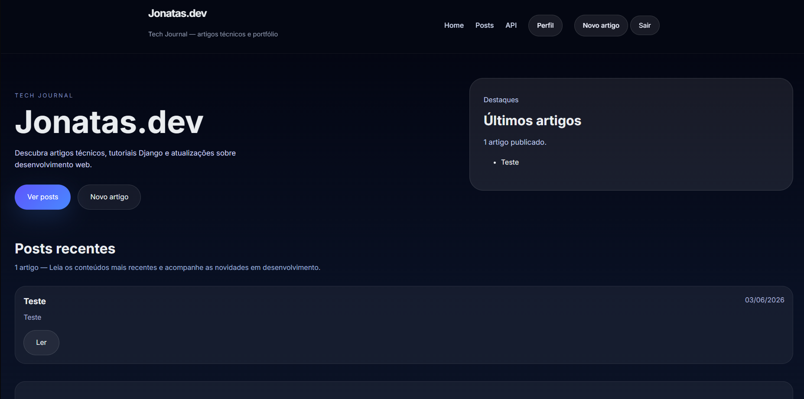
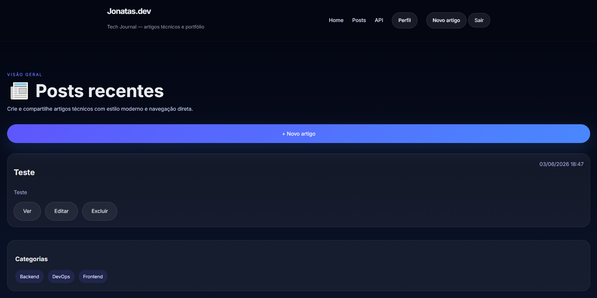
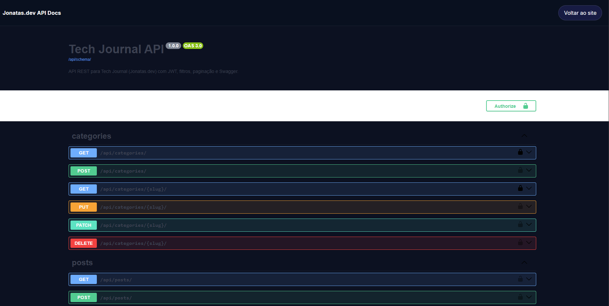

# Jonatas.dev — Tech Journal
## 🌐 Demo

**Site:** https://jonatas-dev-blog-production.up.railway.app

**API Docs:** https://jonatas-dev-blog-production.up.railway.app/api/docs/

Blog pessoal desenvolvido com Django, com API REST completa, autenticação JWT, documentação Swagger e sistema de perfis de usuário.

## 🚀 Deploy

- Produção: https://jonatas-dev-blog-production.up.railway.app
- Documentação da API: https://jonatas-dev-blog-production.up.railway.app/api/docs/---

## 📸 Screenshots

### Home


### Lista de Posts


### API Docs (Swagger)


---

## 🚀 Stack

| Tecnologia | Uso |
|---|---|
| Python 3.13 | Linguagem principal |
| Django 6 | Framework web |
| Django REST Framework | API REST |
| djangorestframework-simplejwt | Autenticação JWT |
| drf-spectacular | Documentação OpenAPI/Swagger |
| django-filters | Filtros na API |
| Pillow | Upload de imagens (avatar) |
| SQLite | Banco de dados |
| WhiteNoise | Servir arquivos estáticos |

---

## ✨ Funcionalidades

### Blog
- Listagem e detalhe de posts
- Criação, edição e exclusão de posts (autenticado)
- Categorias e tags por post
- Filtro de posts por categoria
- Criação rápida de categoria/tag via AJAX

### Usuários
- Cadastro de conta
- Login e logout
- Edição de perfil: avatar, bio, GitHub, LinkedIn

### API REST
- CRUD completo de posts, categorias e tags
- Autenticação via JWT (Bearer token)
- Filtros por categoria, tag e autor
- Busca por título e conteúdo
- Ordenação por data e título
- Paginação
- Documentação interativa em `/api/docs/`
- Permissões: autor edita só os próprios posts, admin edita tudo

### Extras
- Sitemap em `/sitemap.xml`
- Meta tags Open Graph e Twitter Card
- Design responsivo dark mode

## Testes Automatizados

O projeto possui uma suíte de testes automatizados desenvolvida com o framework de testes do Django, cobrindo as principais funcionalidades da aplicação.

## ✅ Qualidade de Software

- 91 testes automatizados
- Arquitetura MVC utilizando Django
- API REST documentada com Swagger/OpenAPI
- Controle de permissões customizadas
- Deploy em produção com Railway
- Versionamento com Git e GitHub

### Cobertura dos testes

* Models (Posts, Categorias, Tags e Usuários)
* Views
* URLs
* Autenticação e autorização
* CRUD de posts
* Perfis de usuário
* Permissões da API

### Executar os testes

```bash
python manage.py test
```

Resultado atual:

```text
Ran 91 tests

OK
```
---

## ⚙️ Como rodar localmente

### 1. Clone o repositório

```bash
git clone https://github.com/JonatasDoroteu/meu_primeiro_django.git
cd meu_primeiro_django
```

### 2. Crie e ative o ambiente virtual

```bash
python -m venv venv

# Windows
venv\Scripts\activate

# Linux/Mac
source venv/bin/activate
```

### 3. Instale as dependências

```bash
pip install -r requirements.txt
```

### 4. Rode as migrações

```bash
python manage.py migrate
```

### 5. Crie um superusuário (opcional)

```bash
python manage.py createsuperuser
```

### 6. Inicie o servidor

```bash
python manage.py runserver
```

Acesse: `http://127.0.0.1:8000/`

---

## 📡 Endpoints da API

| Método | Endpoint | Descrição |
|---|---|---|
| POST | `/api/token/` | Obter token JWT |
| POST | `/api/token/refresh/` | Renovar token |
| GET | `/api/posts/` | Listar posts |
| POST | `/api/posts/` | Criar post |
| GET | `/api/posts/{id}/` | Detalhar post |
| PUT/PATCH | `/api/posts/{id}/` | Editar post |
| DELETE | `/api/posts/{id}/` | Excluir post |
| GET | `/api/categories/` | Listar categorias |
| GET | `/api/tags/` | Listar tags |

Documentação completa: `/api/docs/`

---

## 🔐 Autenticação na API

```bash
# 1. Obter token
POST /api/token/
{
  "username": "seu_usuario",
  "password": "sua_senha"
}

# 2. Usar o token nas requisições
Authorization: Bearer <access_token>
```

---

## 💡 Decisões técnicas

- **JWT em vez de session**: stateless, adequado para APIs consumidas por frontends ou mobile
- **IsAuthorOrAdmin**: permissão customizada que permite leitura pública mas restringe escrita ao autor ou admin
- **drf-spectacular**: gera schema OpenAPI automaticamente a partir dos viewsets, sem configuração manual
- **Signals no app `core`**: perfil criado automaticamente ao registrar novo usuário via `post_save`
- **WhiteNoise**: serve arquivos estáticos sem precisar de servidor web separado em desenvolvimento

---

## 📁 Estrutura do projeto

```
meu_primeiro_django/
├── blog/           # App principal: posts, categorias, tags
│   ├── api/        # ViewSets e URLs da API REST
│   ├── templates/
│   ├── models.py
│   ├── serializers.py
│   └── permissions.py
├── users/          # Cadastro e perfil de usuário
├── core/           # Base: templates, signals, configurações gerais
├── config/         # Settings e URLs raiz
└── templates/      # Templates globais (base.html, swagger-ui.html)
```

---

## 👨‍💻 Autor

**Jonatas Doroteu**
- GitHub: [@JonatasDoroteu](https://github.com/JonatasDoroteu)
- LinkedIn: [linkedin.com/in/jonatas-doroteu](https://www.linkedin.com/in/jonatas-doroteu-62ab77208/)
---

> > Projeto desenvolvido para demonstrar conhecimentos em Python, Django, APIs REST, autenticação JWT, testes automatizados, banco de dados e deploy em produção.
